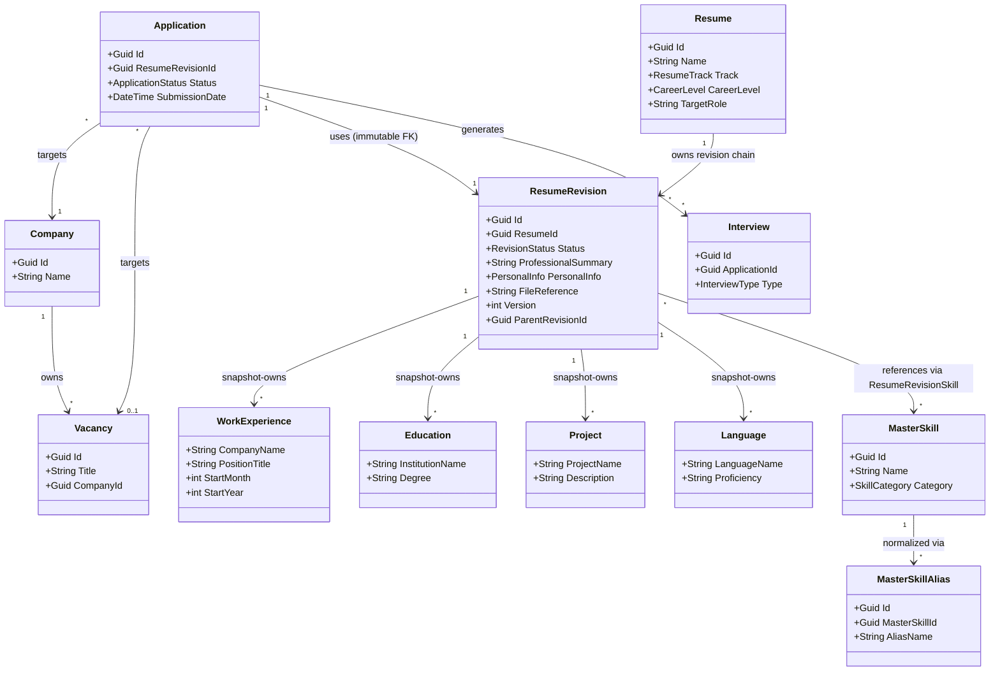
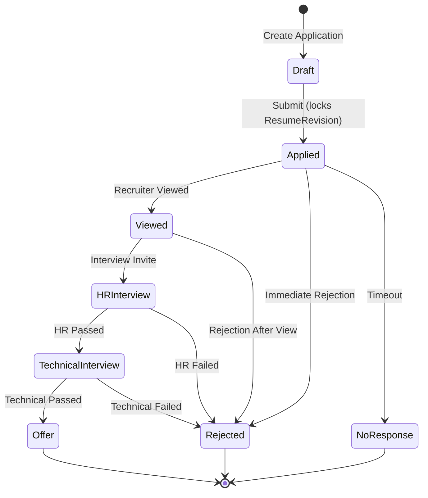
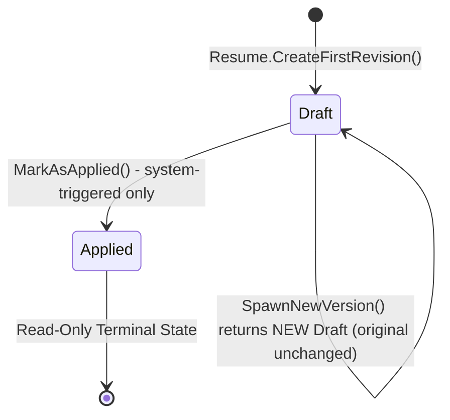

# CareerPulse — Architecture Document

> **Version:** 1.2
> **Date:** 2026-08-10
> **Status:** Accepted
> **Authors:** Architect Subagent (Google Antigravity)

---

## Table of Contents

1. [Overall Architecture Style Evaluation & Recommendation](#1-overall-architecture-style-evaluation--recommendation)
2. [Domain Boundaries & Aggregate Roots Alignment](#2-domain-boundaries--aggregate-roots-alignment)
3. [C# Entity Framework Core Entity Models](#3-c-entity-framework-core-entity-models)
4. [MasterSkill & Alias Normalization Schemas](#4-masterskill--alias-normalization-schemas)
5. [Status State Machine & Workflow Rules](#5-status-state-machine--workflow-rules)
6. [Storage Provider Abstraction Design (IFileStorage)](#6-storage-provider-abstraction-design-ifilestorage)
7. [AI Responsibility Boundaries & HITL API Contracts](#7-ai-responsibility-boundaries--hitl-api-contracts)
8. [RFC 7807 Error DTO & Validation Strategy](#8-rfc-7807-error-dto--validation-strategy)
9. [C# Project & Folder Layout](#9-c-project--folder-layout)
10. [Architectural Risks, Assumptions & Open Questions](#10-architectural-risks-assumptions--open-questions)

---

## 1. Overall Architecture Style Evaluation & Recommendation

### 1.1 Evaluation of Architectural Styles

| Architecture Style | Pros for CareerPulse | Cons for CareerPulse |
|---|---|---|
| **Clean Architecture** | Strict separation of concerns; protects complex domain rules (Draft Immutability, HITL); independent of UI, database, and external APIs; explicit dependency inversion aligns with ADR 001-008 | High initial boilerplate (DTO-Entity-Domain mapping layers); can feel over-engineered for simple CRUD features |
| **Vertical Slice Architecture** | High cohesion per feature; easy to scale development per use case; excellent for CQRS (Command/Query separation) | Can lead to cross-slice code duplication; requires discipline to not bypass domain invariants per slice |
| **Modular Monolith** | Logical boundaries (modules) with simple single-deployment; good for separating Bounded Contexts (Career vs AI Advisory) | Harder to enforce strict boundaries than physical project separation; risk of devolving into a "big ball of mud" |
| **Hexagonal Architecture** | Domain is the pure center (Ports & Adapters pattern); highly testable — mocking IFileStorage and AI Services is natural; aligns with ADR 003 storage abstraction | Port/Adapter terminology can be confusing for new contributors; less prescriptive on internal layer structure than Clean Architecture |

### 1.2 Final Recommendation: Clean Architecture + CQRS

**Adopted Pattern:** **Clean Architecture**, supplemented by **CQRS principles** (via MediatR) for command/query separation.

#### Why Clean Architecture?

**1. Strict Domain Isolation — The #1 Priority**

CareerPulse has non-trivial, non-negotiable domain rules:
- `ResumeRevision` is immutable once linked to an `Application` (ADR 005).
- All skills must be normalized against `MasterSkill`/`MasterSkillAlias` (ADR 006).
- AI must never mutate database state without explicit user confirmation (ADR 008).

Clean Architecture places the **Domain layer at the absolute center**, completely oblivious to Entity Framework, Gemini AI, or ASP.NET Core. This guarantees business rules cannot be accidentally bypassed at the infrastructure level.

**2. Dependency Inversion Aligns With ADR 003 & ADR 008**

Infrastructure components (PostgreSQL via EF Core, Google Drive API, Gemini AI) are pushed to the outer layer, **implementing interfaces defined in the Application layer** (e.g., `IFileStorage`, `IAIService`). This is the exact pattern mandated by ADR 003.

**3. Testability**

Each layer can be tested in isolation:
- Domain rules are tested with pure unit tests (no EF, no HTTP).
- Application use cases are tested with mocked interfaces.
- Infrastructure adapters are tested with integration tests against a real database.

**4. Long-Term Scalability**

Future integrations (Google Drive Phase 2, Google Calendar, AI Cover Letters) are added as new Adapters/Implementations without modifying the Domain or Application layers.

#### Why Not The Others?

- **Vertical Slice** is excellent for large teams with many independent features. For a personal CRM with a single developer and deep cross-cutting domain invariants, it risks duplicating domain guard logic across slices.
- **Modular Monolith** is architecturally sound but relies on developer discipline to maintain boundaries. The physical project separation in Clean Architecture enforces this at compile time.
- **Hexagonal** is effectively a subset of Clean Architecture philosophy. Clean Architecture is more prescriptive, which is preferable for a project with this many defined ADRs.

#### Trade-offs Accepted

- We accept the overhead of creating mapping layers (DTOs <-> Domain <-> EF Core Entities) to prevent EF Core or AI details from leaking into domain contracts.
- MediatR is adopted for CQRS to keep controllers thin and use cases explicit, at the cost of a dependency on a third-party library.

---

## 2. Domain Boundaries & Aggregate Roots Alignment

### 2.1 Bounded Contexts

| Bounded Context | Responsibility | Key Entities |
|---|---|---|
| **Resume & Skills Context** | Manages resume profiles, revision snapshots, and the global skill catalog | `Resume`, `ResumeRevision`, `MasterSkill`, `MasterSkillAlias` |
| **Job Application Context** | Manages the full job search lifecycle | `Company`, `Vacancy`, `Application`, `Interview` |
| **AI Advisory Context** | Stateless context handling AI interactions. Returns temporary DTOs for HITL confirmation. **Never writes to the database.** | `ResumeImportResultDto`, `ScoredField<T>` |
| **Storage & Backup Context** | Infrastructure concerns for file persistence | `IFileStorage`, `LocalFileStorage`, `GoogleDriveStorage` |

### 2.2 Aggregate Roots & Invariants

#### `Resume` (Aggregate Root)
- **Identity Properties (Immutable after creation):** `Track` (`ResumeTrack`: `Backend`, `Frontend`, `FullStack`), `CareerLevel` (`CareerLevel`: `Intern`, `Junior`, `Middle`, `Senior`, `Lead`), `TargetRole` (string).
- **Mutable Properties:** `Name` (string — user-facing label).
- **Invariants:**
  - A `Resume` profile's `Track`, `CareerLevel`, and `TargetRole` are **immutable after creation**.
  - Changing career track, level, or target role requires creating a **new `Resume` aggregate root**, not spawning a new `ResumeRevision`.
  - Owns the version lineage of its child `ResumeRevision` snapshots.
- **Child Entities:** `ResumeRevision` (1:N — owned snapshot collection).
- **Lifecycle:** Created when a developer defines a new career positioning persona. May coexist with other `Resume` profiles targeting different tracks/levels.

#### `Company` (Aggregate Root)
- **Invariants:** A `Company` owns its `Vacancy` collection. Vacancies cannot exist without a parent company.
- **Lifecycle:** Created when first referenced; archived but never hard-deleted (preserves application history).

#### `Application` (Central Domain Anchor — Aggregate Root)
- **Invariants:**
  - Must always reference a `Company`.
  - Must reference exactly one `ResumeRevision`.
  - Transitioning to `Applied` status must lock the linked `ResumeRevision` (sets it to `Applied` state).
  - Status transitions are strictly controlled by the state machine (see Section 5).
- **Lifecycle:** Created in `Draft`, terminates at `Offer`, `Rejected`, or `NoResponse`.

#### `ResumeRevision` (Child Snapshot Entity — owned by `Resume`)
- **Invariants (ADR 005 — Draft Immutability):**
  - A `ResumeRevision` is editable **only** in `Draft` state.
  - Once linked to an `Application` and the application advances to `Applied`, the revision becomes **Read-Only** (terminal).
  - Subsequent edits to an applied revision **spawn a new revision** via `SpawnNewVersion()` (Copy-on-Write pattern). The original is never modified.
  - `SpawnNewVersion()` deep-copies `PersonalInfo`, `ProfessionalSummary`, `WorkExperiences`, `Educations`, `Projects`, `Languages`, and `Skills`. `FileReference` is reset to `null`.
- **Owned Snapshot Collections:** `WorkExperience`, `Education`, `Project`, `Language` — deep-copied per revision to guarantee snapshot self-containment.
- **Snapshot Isolation:** `WorkExperience` stores `CompanyName` as a plain string snapshot (not a FK to `Company`). Work experience dates use month/year precision only.
- **PDF Ownership:** `FileReference` belongs to `ResumeRevision`, not to `Resume`.
- **Lifecycle:** Draft → Applied (terminal, Read-Only).

### 2.3 Domain Relationship Diagram



---

## 3. C# Entity Framework Core Entity Models

### 3.1 Enumerations

```csharp
namespace CareerPulse.Domain.Enums;

public enum ApplicationStatus
{
    Draft, Applied, Viewed, HRInterview, TechnicalInterview, Offer, Rejected, NoResponse
}

public enum RevisionStatus
{
    Draft,
    Applied // Terminal - Read-Only
}

public enum SkillCategory
{
    ProgrammingLanguage, Framework, ORM, Database, Cloud,
    DevOps, Messaging, Testing, Tools, SoftSkill, Other
}

public enum InterviewType
{
    PhoneScreen, HRInterview, TechnicalInterview, SystemDesign, CodingChallenge, FinalRound
}

public enum ResumeTrack
{
    Backend, Frontend, FullStack
}

public enum CareerLevel
{
    Intern, Junior, Middle, Senior, Lead
}
```

### 3.2 Domain Entities

```csharp
namespace CareerPulse.Domain.Entities;

// Application (Central Anchor)
public sealed class Application
{
    public Guid Id { get; private set; }
    public Guid CompanyId { get; private set; }
    public Guid? VacancyId { get; private set; }

    /// <summary>
    /// Immutable after creation. There is no domain operation that changes
    /// ResumeRevisionId once the Application has been created.
    /// </summary>
    public Guid ResumeRevisionId { get; private set; }

    public ApplicationStatus Status { get; private set; }
    public DateTime? SubmissionDate { get; private set; }
    public string JobSource { get; private set; } = string.Empty;
    public string? Notes { get; private set; }
    public DateTime CreatedAt { get; private set; }
    public DateTime UpdatedAt { get; private set; }

    public Company Company { get; private set; } = null!;
    public Vacancy? Vacancy { get; private set; }
    public ResumeRevision ResumeRevision { get; private set; } = null!;

    private readonly List<Interview> _interviews = new();
    public IReadOnlyCollection<Interview> Interviews => _interviews.AsReadOnly();

    private Application() { }

    public static Application Create(Guid companyId, Guid resumeRevisionId, string jobSource, Guid? vacancyId = null)
        => new()
        {
            Id = Guid.NewGuid(),
            CompanyId = companyId,
            VacancyId = vacancyId,
            ResumeRevisionId = resumeRevisionId,
            Status = ApplicationStatus.Draft,
            JobSource = jobSource,
            CreatedAt = DateTime.UtcNow,
            UpdatedAt = DateTime.UtcNow
        };

    /// <summary>
    /// Transitions the Application to a new status.
    /// When transitioning to Applied, the linked ResumeRevision is explicitly
    /// marked as Applied (read-only terminal state) via ResumeRevision.MarkAsApplied().
    /// This ensures the snapshot is locked and can no longer be modified directly.
    /// </summary>
    public void TransitionTo(ApplicationStatus newStatus)
    {
        ApplicationStatusMachine.ValidateTransition(Status, newStatus);
        Status = newStatus;
        UpdatedAt = DateTime.UtcNow;
        if (newStatus == ApplicationStatus.Applied)
        {
            SubmissionDate = DateTime.UtcNow;
            ResumeRevision.MarkAsApplied();
        }
    }
}

// Value Object: PersonalInfo (ADR 007 Recommendation)
public sealed record PersonalInfo(
    string FirstName,
    string LastName,
    string Email,
    string? Phone = null,
    string? LinkedInUrl = null,
    string? GitHubUrl = null,
    string? City = null,
    string? Country = null
);

// Resume (Aggregate Root — Career Profile Container)
public sealed class Resume
{
    public Guid Id { get; private set; }
    public string Name { get; private set; } = string.Empty;
    public ResumeTrack Track { get; private set; }
    public CareerLevel CareerLevel { get; private set; }
    public string TargetRole { get; private set; } = string.Empty;
    public DateTime CreatedAt { get; private set; }
    public DateTime UpdatedAt { get; private set; }

    private readonly List<ResumeRevision> _revisions = new();
    public IReadOnlyCollection<ResumeRevision> Revisions => _revisions.AsReadOnly();

    private Resume() { }

    public static Resume Create(string name, ResumeTrack track, CareerLevel careerLevel, string targetRole) => new()
    {
        Id = Guid.NewGuid(),
        Name = name,
        Track = track,
        CareerLevel = careerLevel,
        TargetRole = targetRole,
        CreatedAt = DateTime.UtcNow,
        UpdatedAt = DateTime.UtcNow
    };

    public void UpdateName(string name)
    {
        Name = name;
        UpdatedAt = DateTime.UtcNow;
    }

    /// <summary>
    /// Creates the first ResumeRevision (v1) under this Resume aggregate.
    /// Must be called as a separate explicit operation after Resume.Create().
    /// The resulting revision has Version = 1, Status = Draft, ParentRevisionId = null.
    /// </summary>
    public ResumeRevision CreateFirstRevision(string professionalSummary, PersonalInfo personalInfo)
    {
        if (_revisions.Count > 0)
            throw new DomainException("First revision already exists. Use SpawnNewVersion() on an existing revision.");

        var revision = ResumeRevision.CreateDraft(Id, professionalSummary, personalInfo);
        _revisions.Add(revision);
        UpdatedAt = DateTime.UtcNow;
        return revision;
    }
}

// ResumeRevision (Snapshot — Child Entity of Resume, Copy-on-Write)
public sealed class ResumeRevision
{
    public Guid Id { get; private set; }
    public Guid ResumeId { get; private set; }
    public RevisionStatus Status { get; private set; }
    public string ProfessionalSummary { get; private set; } = string.Empty;
    public PersonalInfo PersonalInfo { get; private set; } = null!;
    public string? FileReference { get; private set; }
    public int Version { get; private set; }
    public Guid? ParentRevisionId { get; private set; }
    public DateTime CreatedAt { get; private set; }
    public DateTime UpdatedAt { get; private set; }

    private readonly List<ResumeRevisionSkill> _skills = new();
    public IReadOnlyCollection<ResumeRevisionSkill> Skills => _skills.AsReadOnly();

    private readonly List<WorkExperience> _workExperiences = new();
    public IReadOnlyCollection<WorkExperience> WorkExperiences => _workExperiences.AsReadOnly();

    private readonly List<Education> _educations = new();
    public IReadOnlyCollection<Education> Educations => _educations.AsReadOnly();

    private readonly List<Project> _projects = new();
    public IReadOnlyCollection<Project> Projects => _projects.AsReadOnly();

    private readonly List<Language> _languages = new();
    public IReadOnlyCollection<Language> Languages => _languages.AsReadOnly();

    private ResumeRevision() { }

    /// <summary>
    /// Internal factory for creating a first Draft revision.
    /// Called exclusively by Resume.CreateFirstRevision() to ensure aggregate root ownership.
    /// Version = 1, Status = Draft, ParentRevisionId = null, ResumeId = owning Resume.
    /// </summary>
    internal static ResumeRevision CreateDraft(Guid resumeId, string summary, PersonalInfo personalInfo) => new()
    {
        Id = Guid.NewGuid(),
        ResumeId = resumeId,
        Status = RevisionStatus.Draft,
        ProfessionalSummary = summary,
        PersonalInfo = personalInfo,
        Version = 1,
        ParentRevisionId = null,
        CreatedAt = DateTime.UtcNow,
        UpdatedAt = DateTime.UtcNow
    };

    /// <summary>
    /// Copy-on-Write: creates a new Draft revision from this one.
    ///
    /// Required behavior — the new revision MUST:
    ///   - Receive a new Id (Guid.NewGuid())
    ///   - Remain under the same ResumeId
    ///   - Have Status = Draft
    ///   - Increment Version (Version + 1)
    ///   - Set ParentRevisionId to this revision's Id
    ///   - Set FileReference = null (PDF is NOT carried over)
    ///
    /// The implementation MUST deep-copy all owned snapshot collections:
    ///   - PersonalInfo           (value object — copied by value)
    ///   - ProfessionalSummary    (string — copied by value)
    ///   - WorkExperience         (owned child entities — each entry deep-copied with new Id)
    ///   - Education              (owned child entities — each entry deep-copied with new Id)
    ///   - Project                (owned child entities — each entry deep-copied with new Id)
    ///   - Language               (owned child entities — each entry deep-copied with new Id)
    ///   - ResumeRevisionSkill    (join entities — each entry deep-copied with new ResumeRevisionId)
    ///
    /// Each deep-copied child entity receives a new Id and the new revision's ResumeRevisionId.
    /// The original revision and its owned data remain completely unchanged.
    /// </summary>
    public ResumeRevision SpawnNewVersion()
    {
        var copy = new ResumeRevision
        {
            Id = Guid.NewGuid(),
            ResumeId = ResumeId,
            Status = RevisionStatus.Draft,
            ProfessionalSummary = ProfessionalSummary,
            PersonalInfo = PersonalInfo,
            FileReference = null,
            Version = Version + 1,
            ParentRevisionId = Id,
            CreatedAt = DateTime.UtcNow,
            UpdatedAt = DateTime.UtcNow
        };

        // Deep-copy owned child entities — each receives a new Id + new ResumeRevisionId.
        // Implementation must iterate each collection and copy every entry.
        // WorkExperiences  → copy._workExperiences
        // Educations       → copy._educations
        // Projects         → copy._projects
        // Languages        → copy._languages
        // Skills           → copy._skills (with new ResumeRevisionId)

        return copy;
    }

    public void UpdateContent(string summary, PersonalInfo personalInfo)
    {
        if (Status == RevisionStatus.Applied)
            throw new DomainException("Cannot modify an Applied ResumeRevision. Create a new version instead.");
        ProfessionalSummary = summary;
        PersonalInfo = personalInfo;
        UpdatedAt = DateTime.UtcNow;
    }

    public void SetFileReference(string fileReference)
    {
        if (Status == RevisionStatus.Applied)
            throw new DomainException("Cannot modify file reference on an Applied ResumeRevision.");
        FileReference = fileReference;
        UpdatedAt = DateTime.UtcNow;
    }

    public void MarkAsApplied()
    {
        if (Status == RevisionStatus.Applied)
            throw new DomainException("ResumeRevision is already in Applied state.");
        Status = RevisionStatus.Applied;
        UpdatedAt = DateTime.UtcNow;
    }

    public void AddSkill(Guid masterSkillId, int proficiencyLevel = 3)
    {
        if (Status == RevisionStatus.Applied)
            throw new DomainException("Cannot modify skills on an Applied ResumeRevision.");
        if (_skills.Any(s => s.MasterSkillId == masterSkillId))
            throw new DomainException("Skill already added to this revision.");
        _skills.Add(new ResumeRevisionSkill(Id, masterSkillId, proficiencyLevel));
    }
}

// Company
public sealed class Company
{
    public Guid Id { get; private set; }
    public string Name { get; private set; } = string.Empty;
    public string? Website { get; private set; }
    public string? Industry { get; private set; }
    public string? Notes { get; private set; }
    public DateTime CreatedAt { get; private set; }

    private readonly List<Vacancy> _vacancies = new();
    public IReadOnlyCollection<Vacancy> Vacancies => _vacancies.AsReadOnly();

    private Company() { }
    public static Company Create(string name, string? website = null) => new()
    {
        Id = Guid.NewGuid(), Name = name, Website = website, CreatedAt = DateTime.UtcNow
    };
}

// Vacancy
public sealed class Vacancy
{
    public Guid Id { get; private set; }
    public Guid CompanyId { get; private set; }
    public string Title { get; private set; } = string.Empty;
    public string? Description { get; private set; }
    public string? Url { get; private set; }
    public DateTime? PostedAt { get; private set; }
    public DateTime CreatedAt { get; private set; }

    private Vacancy() { }
    public static Vacancy Create(Guid companyId, string title, string? url = null) => new()
    {
        Id = Guid.NewGuid(), CompanyId = companyId, Title = title, Url = url, CreatedAt = DateTime.UtcNow
    };
}

// Interview
public sealed class Interview
{
    public Guid Id { get; private set; }
    public Guid ApplicationId { get; private set; }
    public InterviewType Type { get; private set; }
    public DateTime ScheduledAt { get; private set; }
    public string? Notes { get; private set; }
    public string? Feedback { get; private set; }
    public DateTime CreatedAt { get; private set; }

    private Interview() { }
    public static Interview Schedule(Guid applicationId, InterviewType type, DateTime scheduledAt) => new()
    {
        Id = Guid.NewGuid(), ApplicationId = applicationId, Type = type,
        ScheduledAt = scheduledAt, CreatedAt = DateTime.UtcNow
    };
}

// ResumeRevisionSkill (Join Entity)
public sealed class ResumeRevisionSkill
{
    public Guid ResumeRevisionId { get; private set; }
    public Guid MasterSkillId { get; private set; }
    public int ProficiencyLevel { get; private set; } // 1-5

    public MasterSkill MasterSkill { get; private set; } = null!;

    internal ResumeRevisionSkill(Guid revisionId, Guid masterSkillId, int proficiency)
    {
        ResumeRevisionId = revisionId;
        MasterSkillId = masterSkillId;
        ProficiencyLevel = proficiency;
    }

    private ResumeRevisionSkill() { }
}

// Owned Child Entities (owned by ResumeRevision, deep-copied per SpawnNewVersion)

public sealed class WorkExperience
{
    public Guid Id { get; private set; }
    public Guid ResumeRevisionId { get; private set; }
    public string CompanyName { get; private set; } = string.Empty; // String snapshot, NOT FK to Company
    public string PositionTitle { get; private set; } = string.Empty;
    public int StartMonth { get; private set; }
    public int StartYear { get; private set; }
    public int? EndMonth { get; private set; }
    public int? EndYear { get; private set; }
    public bool IsCurrentJob { get; private set; }
    public string? Description { get; private set; }
    public string? Achievements { get; private set; }
    public string? TechStack { get; private set; }
    public DateTime CreatedAt { get; private set; }

    private WorkExperience() { }
}

public sealed class Education
{
    public Guid Id { get; private set; }
    public Guid ResumeRevisionId { get; private set; }
    public string InstitutionName { get; private set; } = string.Empty;
    public string? Degree { get; private set; }
    public string? FieldOfStudy { get; private set; }
    public int? StartYear { get; private set; }
    public int? EndYear { get; private set; }
    public DateTime CreatedAt { get; private set; }

    private Education() { }
}

public sealed class Project
{
    public Guid Id { get; private set; }
    public Guid ResumeRevisionId { get; private set; }
    public string ProjectName { get; private set; } = string.Empty;
    public string? Description { get; private set; }
    public string? Role { get; private set; }
    public string? RepositoryUrl { get; private set; }
    public string? LiveDemoUrl { get; private set; }
    public string? TechStack { get; private set; }
    public DateTime CreatedAt { get; private set; }

    private Project() { }
}

public sealed class Language
{
    public Guid Id { get; private set; }
    public Guid ResumeRevisionId { get; private set; }
    public string LanguageName { get; private set; } = string.Empty;
    public string? Proficiency { get; private set; }
    public DateTime CreatedAt { get; private set; }

    private Language() { }
}

// Domain Exception
public sealed class DomainException : Exception
{
    public DomainException(string message) : base(message) { }
}
```

### 3.3 EF Core Fluent API Configurations

```csharp
namespace CareerPulse.Infrastructure.Persistence.Configurations;

public class ApplicationConfiguration : IEntityTypeConfiguration<Application>
{
    public void Configure(EntityTypeBuilder<Application> builder)
    {
        builder.ToTable("Applications");
        builder.HasKey(x => x.Id);
        builder.Property(x => x.Status).HasConversion<string>().IsRequired();
        builder.Property(x => x.JobSource).HasMaxLength(200).IsRequired();
        builder.Property(x => x.Notes).HasMaxLength(4000);

        builder.HasOne(x => x.Company).WithMany().HasForeignKey(x => x.CompanyId).OnDelete(DeleteBehavior.Restrict);
        builder.HasOne(x => x.Vacancy).WithMany().HasForeignKey(x => x.VacancyId).OnDelete(DeleteBehavior.SetNull);
        builder.HasOne(x => x.ResumeRevision).WithMany().HasForeignKey(x => x.ResumeRevisionId).OnDelete(DeleteBehavior.Restrict);
        builder.HasMany(x => x.Interviews).WithOne().HasForeignKey(x => x.ApplicationId).OnDelete(DeleteBehavior.Cascade);

        builder.HasIndex(x => x.Status);
        builder.HasIndex(x => x.CompanyId);
        builder.HasIndex(x => x.SubmissionDate);
    }
}

public class ResumeConfiguration : IEntityTypeConfiguration<Resume>
{
    public void Configure(EntityTypeBuilder<Resume> builder)
    {
        builder.ToTable("Resumes");
        builder.HasKey(x => x.Id);
        builder.Property(x => x.Name).HasMaxLength(300).IsRequired();
        builder.Property(x => x.Track).HasConversion<string>().IsRequired();
        builder.Property(x => x.CareerLevel).HasConversion<string>().IsRequired();
        builder.Property(x => x.TargetRole).HasMaxLength(300).IsRequired();

        builder.HasMany(x => x.Revisions).WithOne().HasForeignKey(x => x.ResumeId).OnDelete(DeleteBehavior.Cascade);

        builder.HasIndex(x => x.Track);
        builder.HasIndex(x => x.CareerLevel);
    }
}

public class ResumeRevisionConfiguration : IEntityTypeConfiguration<ResumeRevision>
{
    public void Configure(EntityTypeBuilder<ResumeRevision> builder)
    {
        builder.ToTable("ResumeRevisions");
        builder.HasKey(x => x.Id);
        builder.Property(x => x.Status).HasConversion<string>().IsRequired();
        builder.Property(x => x.ProfessionalSummary).HasColumnType("text");

        builder.OwnsOne(x => x.PersonalInfo, info =>
        {
            info.Property(p => p.FirstName).HasMaxLength(100).IsRequired();
            info.Property(p => p.LastName).HasMaxLength(100).IsRequired();
            info.Property(p => p.Email).HasMaxLength(250).IsRequired();
            info.Property(p => p.Phone).HasMaxLength(50);
            info.Property(p => p.LinkedInUrl).HasMaxLength(500);
            info.Property(p => p.GitHubUrl).HasMaxLength(500);
            info.Property(p => p.City).HasMaxLength(100);
            info.Property(p => p.Country).HasMaxLength(100);
        });

        builder.Property(x => x.FileReference).HasMaxLength(1000);

        builder.HasMany(x => x.Skills)
            .WithOne()
            .HasForeignKey(x => x.ResumeRevisionId)
            .OnDelete(DeleteBehavior.Cascade);

        builder.HasMany(x => x.WorkExperiences)
            .WithOne()
            .HasForeignKey(x => x.ResumeRevisionId)
            .OnDelete(DeleteBehavior.Cascade);

        builder.HasMany(x => x.Educations)
            .WithOne()
            .HasForeignKey(x => x.ResumeRevisionId)
            .OnDelete(DeleteBehavior.Cascade);

        builder.HasMany(x => x.Projects)
            .WithOne()
            .HasForeignKey(x => x.ResumeRevisionId)
            .OnDelete(DeleteBehavior.Cascade);

        builder.HasMany(x => x.Languages)
            .WithOne()
            .HasForeignKey(x => x.ResumeRevisionId)
            .OnDelete(DeleteBehavior.Cascade);

        builder.HasIndex(x => x.ResumeId);
        builder.HasIndex(x => x.Status);
        builder.HasIndex(x => x.ParentRevisionId);
    }
}

public class ResumeRevisionSkillConfiguration : IEntityTypeConfiguration<ResumeRevisionSkill>
{
    public void Configure(EntityTypeBuilder<ResumeRevisionSkill> builder)
    {
        builder.ToTable("ResumeRevisionSkills");
        builder.HasKey(x => new { x.ResumeRevisionId, x.MasterSkillId });
        builder.Property(x => x.ProficiencyLevel).HasDefaultValue(3);
        builder.HasOne(x => x.MasterSkill)
            .WithMany()
            .HasForeignKey(x => x.MasterSkillId)
            .OnDelete(DeleteBehavior.Restrict);
    }
}
```

---

## 4. MasterSkill & Alias Normalization Schemas

### 4.1 Entity Definitions

```csharp
namespace CareerPulse.Domain.Entities;

public sealed class MasterSkill
{
    public Guid Id { get; private set; }
    public string Name { get; private set; } = string.Empty;  // Canonical name: "PostgreSQL"
    public SkillCategory Category { get; private set; }
    public bool IsActive { get; private set; } = true;
    public DateTime CreatedAt { get; private set; }

    private readonly List<MasterSkillAlias> _aliases = new();
    public IReadOnlyCollection<MasterSkillAlias> Aliases => _aliases.AsReadOnly();

    private MasterSkill() { }

    public static MasterSkill Create(string name, SkillCategory category) => new()
    {
        Id = Guid.NewGuid(), Name = name, Category = category, CreatedAt = DateTime.UtcNow
    };

    public void AddAlias(string aliasName)
    {
        if (_aliases.Any(a => a.AliasName.Equals(aliasName, StringComparison.OrdinalIgnoreCase)))
            throw new DomainException($"Alias '{aliasName}' already exists for skill '{Name}'.");
        _aliases.Add(new MasterSkillAlias(Id, aliasName));
    }
}

public sealed class MasterSkillAlias
{
    public Guid Id { get; private set; }
    public Guid MasterSkillId { get; private set; }
    public string AliasName { get; private set; } = string.Empty; // e.g., "Postgres", "PGSQL"
    public DateTime CreatedAt { get; private set; }

    internal MasterSkillAlias(Guid masterSkillId, string aliasName)
    {
        Id = Guid.NewGuid();
        MasterSkillId = masterSkillId;
        AliasName = aliasName.Trim();
        CreatedAt = DateTime.UtcNow;
    }

    private MasterSkillAlias() { }
}
```

### 4.2 EF Core Configuration

```csharp
public class MasterSkillConfiguration : IEntityTypeConfiguration<MasterSkill>
{
    public void Configure(EntityTypeBuilder<MasterSkill> builder)
    {
        builder.ToTable("MasterSkills");
        builder.HasKey(x => x.Id);
        builder.Property(x => x.Name).HasMaxLength(200).IsRequired();
        builder.Property(x => x.Category).HasConversion<string>().IsRequired();

        builder.HasIndex(x => x.Name).IsUnique(); // Canonical name is globally unique
        builder.HasIndex(x => x.Category);

        builder.HasMany(x => x.Aliases).WithOne().HasForeignKey(x => x.MasterSkillId).OnDelete(DeleteBehavior.Cascade);
    }
}

public class MasterSkillAliasConfiguration : IEntityTypeConfiguration<MasterSkillAlias>
{
    public void Configure(EntityTypeBuilder<MasterSkillAlias> builder)
    {
        builder.ToTable("MasterSkillAliases");
        builder.HasKey(x => x.Id);
        builder.Property(x => x.AliasName).HasMaxLength(200).IsRequired();
        builder.HasIndex(x => new { x.MasterSkillId, x.AliasName }).IsUnique();
    }
}
```

### 4.3 Skill Normalization Workflow

Pipeline: `AI Extracted Skills -> Normalization Service (read-only) -> HITL Review -> User Confirms -> Persist`

**Steps:**
1. AI returns raw skill strings: `["React.js", "EF Core", "UnknownTool99"]`
2. Normalization Service queries `MasterSkills` + `MasterSkillAliases` (read-only):
   - `"React.js"` -> alias match -> `MasterSkill("React", Framework)`
   - `"EF Core"` -> alias match -> `MasterSkill("Entity Framework Core", ORM)`
   - `"UnknownTool99"` -> **no match** -> flagged for HITL
3. UI presents HITL Skill Resolution Dialog for each unmatched skill:

| Action | User Decision | System Result |
|---|---|---|
| **Create New** | User assigns Name + Category | New `MasterSkill` + alias saved |
| **Map to Existing** | User selects existing skill | New `MasterSkillAlias` saved |
| **Ignore** | User dismisses | Excluded from import |

4. After all resolutions confirmed, skills are linked to the `ResumeRevision`.

> **ADR 008 Compliance:** The AI Normalization Service is strictly **read-only**. Only explicit user confirmation triggers writes.

---

## 5. Status State Machine & Workflow Rules

### 5.1 Application Status State Machine



### 5.2 Valid Transition Table

| From \ To | Draft | Applied | Viewed | HRInterview | TechnicalInterview | Offer | Rejected | NoResponse |
|---|:---:|:---:|:---:|:---:|:---:|:---:|:---:|:---:|
| **Draft** | - | YES | - | - | - | - | - | - |
| **Applied** | - | - | YES | - | - | - | YES | YES |
| **Viewed** | - | - | - | YES | - | - | YES | - |
| **HRInterview** | - | - | - | - | YES | - | YES | - |
| **TechnicalInterview** | - | - | - | - | - | YES | YES | - |

### 5.3 ApplicationStatusMachine Implementation

```csharp
namespace CareerPulse.Domain.StateMachines;

public static class ApplicationStatusMachine
{
    private static readonly Dictionary<ApplicationStatus, HashSet<ApplicationStatus>> _validTransitions = new()
    {
        [ApplicationStatus.Draft]              = [ApplicationStatus.Applied],
        [ApplicationStatus.Applied]            = [ApplicationStatus.Viewed, ApplicationStatus.Rejected, ApplicationStatus.NoResponse],
        [ApplicationStatus.Viewed]             = [ApplicationStatus.HRInterview, ApplicationStatus.Rejected],
        [ApplicationStatus.HRInterview]        = [ApplicationStatus.TechnicalInterview, ApplicationStatus.Rejected],
        [ApplicationStatus.TechnicalInterview] = [ApplicationStatus.Offer, ApplicationStatus.Rejected],
        [ApplicationStatus.Offer]              = [],
        [ApplicationStatus.Rejected]           = [],
        [ApplicationStatus.NoResponse]         = [],
    };

    public static void ValidateTransition(ApplicationStatus current, ApplicationStatus next)
    {
        if (!_validTransitions.TryGetValue(current, out var allowed) || !allowed.Contains(next))
            throw new DomainException(
                $"Invalid status transition: {current} -> {next}. " +
                $"Allowed from {current}: [{string.Join(", ", _validTransitions[current])}]");
    }

    public static IReadOnlySet<ApplicationStatus> GetAllowedTransitions(ApplicationStatus current)
        => _validTransitions.TryGetValue(current, out var set) ? set : new HashSet<ApplicationStatus>();
}
```

### 5.4 ResumeRevision Status State Machine



**Guard Rule:** `MarkAsApplied()` is called by `ApplicationService` only — never by user action directly. Editing an Applied revision calls `SpawnNewVersion()` which returns a brand-new `Draft`, leaving the original immutable.

---

## 6. Storage Provider Abstraction Design (IFileStorage)

### 6.1 Interface Definition (Per ADR 003)

```csharp
namespace CareerPulse.Application.Interfaces;

/// <summary>
/// Abstraction for file storage. Defined in Application layer per ADR 003.
/// Implementations live in Infrastructure.
/// </summary>
public interface IFileStorage
{
    /// <summary>Saves a file and returns a storage reference key.</summary>
    Task<string> SaveFileAsync(Stream stream, string fileName, string contentType, CancellationToken ct = default);

    /// <summary>Retrieves a file stream by its reference key.</summary>
    Task<Stream> GetFileAsync(string fileReference, CancellationToken ct = default);

    /// <summary>Deletes a file by its reference key.</summary>
    Task DeleteFileAsync(string fileReference, CancellationToken ct = default);

    /// <summary>Returns a temporary download URL. Returns null for local storage.</summary>
    Task<string?> GetDownloadUrlAsync(string fileReference, TimeSpan expiry, CancellationToken ct = default);
}
```

### 6.2 LocalFileStorage Implementation (MVP)

```csharp
namespace CareerPulse.Infrastructure.Storage;

public sealed class LocalFileStorage : IFileStorage
{
    private readonly string _basePath;
    private readonly ILogger<LocalFileStorage> _logger;

    public LocalFileStorage(IConfiguration configuration, ILogger<LocalFileStorage> logger)
    {
        _basePath = configuration["Storage:LocalBasePath"]
            ?? Path.Combine(AppContext.BaseDirectory, "storage");
        _logger = logger;
        Directory.CreateDirectory(_basePath);
    }

    public async Task<string> SaveFileAsync(Stream stream, string fileName, string contentType, CancellationToken ct = default)
    {
        var uniqueFileName = $"{Guid.NewGuid()}_{Path.GetFileName(fileName)}";
        var fullPath = Path.Combine(_basePath, uniqueFileName);
        await using var fileStream = File.Create(fullPath);
        await stream.CopyToAsync(fileStream, ct);
        _logger.LogInformation("File saved: {FilePath}", fullPath);
        return uniqueFileName; // This is the fileReference stored in DB
    }

    public async Task<Stream> GetFileAsync(string fileReference, CancellationToken ct = default)
    {
        var fullPath = Path.Combine(_basePath, fileReference);
        if (!File.Exists(fullPath))
            throw new FileNotFoundException($"File not found in local storage: {fileReference}");
        return await Task.FromResult<Stream>(File.OpenRead(fullPath));
    }

    public Task DeleteFileAsync(string fileReference, CancellationToken ct = default)
    {
        var fullPath = Path.Combine(_basePath, fileReference);
        if (File.Exists(fullPath)) File.Delete(fullPath);
        return Task.CompletedTask;
    }

    public Task<string?> GetDownloadUrlAsync(string fileReference, TimeSpan expiry, CancellationToken ct = default)
        => Task.FromResult<string?>(null); // Not applicable for local storage
}
```

### 6.3 GoogleDriveStorage Stub (Phase 2)

```csharp
namespace CareerPulse.Infrastructure.Storage;

public sealed class GoogleDriveStorage : IFileStorage
{
    // TODO Phase 2: Inject DriveService from Google.Apis.Drive.v3

    public Task<string> SaveFileAsync(Stream stream, string fileName, string contentType, CancellationToken ct = default)
        => throw new NotImplementedException("Google Drive storage is planned for Phase 2.");

    public Task<Stream> GetFileAsync(string fileReference, CancellationToken ct = default)
        => throw new NotImplementedException();

    public Task DeleteFileAsync(string fileReference, CancellationToken ct = default)
        => throw new NotImplementedException();

    public Task<string?> GetDownloadUrlAsync(string fileReference, TimeSpan expiry, CancellationToken ct = default)
        => throw new NotImplementedException(); // Phase 2: Returns shareable Google Drive link
}
```

### 6.4 DI Registration

```csharp
// CareerPulse.Infrastructure/DependencyInjection.cs
services.AddScoped<IFileStorage>(sp =>
{
    var config = sp.GetRequiredService<IConfiguration>();
    return (config["Storage:Provider"] ?? "Local") switch
    {
        "GoogleDrive" => (IFileStorage)new GoogleDriveStorage(),
        _ => new LocalFileStorage(config, sp.GetRequiredService<ILogger<LocalFileStorage>>())
    };
});
```

**appsettings.json:**
```json
{
  "Storage": {
    "Provider": "Local",
    "LocalBasePath": "storage/resumes"
  }
}
```

---

## 7. AI Responsibility Boundaries & HITL API Contracts

### 7.1 AI Responsibility Boundary (Per ADR 008)

| Dimension | AI MAY | AI MAY NOT |
|---|---|---|
| **Database** | Read reference data (MasterSkills for normalization) | Write, update, or delete any database record |
| **Entities** | Return temporary DTOs with confidence scores | Create domain entities or trigger state transitions |
| **Status** | Report extraction confidence | Change `ApplicationStatus` or `RevisionStatus` |
| **User Data** | Process user-provided content (PDFs) in memory | Store user data in any persistent medium |
| **Decisions** | Suggest matches and flag low-confidence fields | Make final decisions on skill mapping or data correctness |

> **Core Invariant:** AI is strictly an **advisory component**. All AI output is ephemeral until the user explicitly confirms persistence.

### 7.2 Temporary DTO Structures

```csharp
namespace CareerPulse.Application.DTOs.AI;

/// <summary>
/// Ephemeral DTO returned by AI extraction endpoint.
/// NEVER persisted directly — requires HITL user confirmation.
/// </summary>
public sealed class ResumeImportResultDto
{
    public ScoredField<string> ProfessionalSummary { get; init; } = new();
    public ScoredField<PersonalInfoDto> PersonalInfo { get; init; } = new();
    public List<ScoredSkillDto> ExtractedSkills { get; init; } = [];
    public List<ScoredField<WorkExperienceDto>> WorkExperiences { get; init; } = [];
    public List<string> RawWarnings { get; init; } = []; // Non-blocking AI parsing warnings
}

public sealed class ScoredField<T>
{
    public T? Value { get; init; }
    public double ConfidenceScore { get; init; } // 0.0 to 100.0
    public bool NeedsReview => ConfidenceScore < 70.0;
    public string? ExtractionNote { get; init; }
}

public sealed class ScoredSkillDto
{
    public string RawText { get; init; } = string.Empty;
    public Guid? ResolvedMasterSkillId { get; init; }
    public string? ResolvedMasterSkillName { get; init; }
    public double ConfidenceScore { get; init; }
    public SkillResolutionStatus ResolutionStatus { get; init; }
}

public enum SkillResolutionStatus { AutoResolved, NeedsUserInput, Ignored }
```

### 7.3 HITL API Endpoints

```
POST /api/ai/import-resume
    Body:    multipart/form-data (PDF file)
    Returns: ResumeImportResultDto   [EPHEMERAL - not persisted]

POST /api/ai/resolve-skills
    Body:    List<SkillResolutionDecisionDto>  (user decisions for flagged skills)
    Returns: Updated ResumeImportResultDto     [EPHEMERAL]

POST /api/resumes
    Body:    ConfirmedResumeImportDto          (user-confirmed, reviewed data)
    Action:  The ONLY endpoint that writes to PostgreSQL
    Returns: Created ResumeRevision DTO
```

```csharp
// User-confirmed payload that triggers actual DB persistence
public sealed class ConfirmedResumeImportDto
{
    public string ProfessionalSummary { get; init; } = string.Empty;
    public string PersonalInfoJson { get; init; } = string.Empty;
    public List<ConfirmedSkillDto> Skills { get; init; } = [];
    public string? UploadedFileReference { get; init; } // Pre-saved via IFileStorage
}

public sealed class ConfirmedSkillDto
{
    public Guid MasterSkillId { get; init; }
    public int ProficiencyLevel { get; init; } = 3;
}
```

---

## 8. RFC 7807 Error DTO & Validation Strategy

### 8.1 ProblemDetails Standard Response

All API errors follow RFC 7807 Problem Details for HTTP APIs.

**Domain Rule Violation (HTTP 409):**
```json
{
  "type": "https://careerpulse.local/errors/domain-rule-violation",
  "title": "Domain Rule Violation",
  "status": 409,
  "detail": "Cannot modify an Applied ResumeRevision. Create a new version instead.",
  "instance": "/api/resumes/3fa85f64-5717-4562-b3fc-2c963f66afa6"
}
```

**Validation Error (HTTP 400):**
```json
{
  "type": "https://careerpulse.local/errors/validation-failed",
  "title": "Validation Failed",
  "status": 400,
  "detail": "One or more validation errors occurred.",
  "instance": "/api/applications",
  "errors": {
    "CompanyId": ["'Company Id' must not be empty."],
    "ResumeRevisionId": ["'Resume Revision Id' must not be empty."]
  }
}
```

### 8.2 Global Exception Middleware

```csharp
namespace CareerPulse.Api.Middleware;

public sealed class GlobalExceptionMiddleware
{
    private readonly RequestDelegate _next;
    private readonly ILogger<GlobalExceptionMiddleware> _logger;

    public GlobalExceptionMiddleware(RequestDelegate next, ILogger<GlobalExceptionMiddleware> logger)
    {
        _next = next;
        _logger = logger;
    }

    public async Task InvokeAsync(HttpContext context)
    {
        try { await _next(context); }
        catch (DomainException ex)
        {
            _logger.LogWarning(ex, "Domain rule violation");
            await WriteProblemAsync(context, 409,
                "https://careerpulse.local/errors/domain-rule-violation",
                "Domain Rule Violation", ex.Message);
        }
        catch (ValidationException ex)
        {
            var errors = ex.Errors
                .GroupBy(e => e.PropertyName)
                .ToDictionary(g => g.Key, g => g.Select(e => e.ErrorMessage).ToArray());
            await WriteProblemAsync(context, 400,
                "https://careerpulse.local/errors/validation-failed",
                "Validation Failed", "One or more validation errors occurred.", errors);
        }
        catch (Exception ex)
        {
            _logger.LogError(ex, "Unhandled exception");
            await WriteProblemAsync(context, 500,
                "https://tools.ietf.org/html/rfc7807",
                "Internal Server Error", "An unexpected error occurred.");
        }
    }

    private static async Task WriteProblemAsync(HttpContext context, int status, string type,
        string title, string detail, Dictionary<string, string[]>? errors = null)
    {
        context.Response.StatusCode = status;
        context.Response.ContentType = "application/problem+json";
        var problem = new ProblemDetails { Type = type, Title = title, Status = status,
            Detail = detail, Instance = context.Request.Path };
        if (errors is not null) problem.Extensions["errors"] = errors;
        await context.Response.WriteAsJsonAsync(problem);
    }
}
```

### 8.3 FluentValidation + MediatR Pipeline Behavior

```csharp
namespace CareerPulse.Application.Behaviors;

public sealed class ValidationBehavior<TRequest, TResponse> : IPipelineBehavior<TRequest, TResponse>
    where TRequest : IRequest<TResponse>
{
    private readonly IEnumerable<IValidator<TRequest>> _validators;

    public ValidationBehavior(IEnumerable<IValidator<TRequest>> validators) => _validators = validators;

    public async Task<TResponse> Handle(TRequest request, RequestHandlerDelegate<TResponse> next, CancellationToken ct)
    {
        if (!_validators.Any()) return await next();
        var context = new ValidationContext<TRequest>(request);
        var results = await Task.WhenAll(_validators.Select(v => v.ValidateAsync(context, ct)));
        var failures = results.SelectMany(r => r.Errors).Where(e => e is not null).ToList();
        if (failures.Count > 0) throw new ValidationException(failures);
        return await next();
    }
}

// Example validator
public sealed class CreateApplicationCommandValidator : AbstractValidator<CreateApplicationCommand>
{
    public CreateApplicationCommandValidator()
    {
        RuleFor(x => x.CompanyId).NotEmpty();
        RuleFor(x => x.ResumeRevisionId).NotEmpty();
        RuleFor(x => x.JobSource).NotEmpty().MaximumLength(200);
    }
}
```

---

## 9. C# Project & Folder Layout

### 9.1 Solution Structure

```
CareerPulse.sln
|
+-- src/
|   +-- CareerPulse.Domain/                     [No dependencies - pure domain]
|   |   +-- Entities/
|   |   |   +-- Application.cs
|   |   |   +-- Company.cs
|   |   |   +-- Education.cs
|   |   |   +-- Interview.cs
|   |   |   +-- Language.cs
|   |   |   +-- MasterSkill.cs
|   |   |   +-- MasterSkillAlias.cs
|   |   |   +-- Project.cs
|   |   |   +-- Resume.cs
|   |   |   +-- ResumeRevision.cs
|   |   |   +-- ResumeRevisionSkill.cs
|   |   |   +-- Vacancy.cs
|   |   |   +-- WorkExperience.cs
|   |   +-- Enums/
|   |   |   +-- ApplicationStatus.cs
|   |   |   +-- CareerLevel.cs
|   |   |   +-- InterviewType.cs
|   |   |   +-- ResumeTrack.cs
|   |   |   +-- RevisionStatus.cs
|   |   |   +-- SkillCategory.cs
|   |   +-- Exceptions/
|   |   |   +-- DomainException.cs
|   |   +-- StateMachines/
|   |       +-- ApplicationStatusMachine.cs
|   |
|   +-- CareerPulse.Application/                [references Domain]
|   |   +-- Behaviors/
|   |   |   +-- ValidationBehavior.cs
|   |   +-- DTOs/
|   |   |   +-- AI/
|   |   |   |   +-- ResumeImportResultDto.cs
|   |   |   |   +-- ScoredField.cs
|   |   |   |   +-- ScoredSkillDto.cs
|   |   |   +-- ApplicationDto.cs
|   |   |   +-- CompanyDto.cs
|   |   |   +-- ResumeRevisionDto.cs
|   |   +-- Features/
|   |   |   +-- Applications/
|   |   |   |   +-- Commands/
|   |   |   |   |   +-- CreateApplication/
|   |   |   |   |   |   +-- CreateApplicationCommand.cs
|   |   |   |   |   |   +-- CreateApplicationCommandHandler.cs
|   |   |   |   |   |   +-- CreateApplicationCommandValidator.cs
|   |   |   |   |   +-- TransitionApplicationStatus/
|   |   |   |   |       +-- TransitionStatusCommand.cs
|   |   |   |   |       +-- TransitionStatusCommandHandler.cs
|   |   |   |   +-- Queries/
|   |   |   |       +-- GetApplicationById/
|   |   |   |           +-- GetApplicationByIdQuery.cs
|   |   |   |           +-- GetApplicationByIdQueryHandler.cs
|   |   |   +-- Resumes/
|   |   |   |   +-- Commands/
|   |   |   |       +-- ConfirmResumeImport/
|   |   |   |           +-- ConfirmResumeImportCommand.cs
|   |   |   |           +-- ConfirmResumeImportCommandHandler.cs
|   |   |   +-- Skills/
|   |   |       +-- Commands/
|   |   |           +-- ResolveImportedSkill/
|   |   |               +-- ResolveImportedSkillCommand.cs
|   |   |               +-- ResolveImportedSkillCommandHandler.cs
|   |   +-- Interfaces/
|   |       +-- IAIService.cs
|   |       +-- IApplicationRepository.cs
|   |       +-- IFileStorage.cs
|   |       +-- IUnitOfWork.cs
|   |
|   +-- CareerPulse.Infrastructure/             [references Application + Domain]
|   |   +-- Persistence/
|   |   |   +-- Configurations/
|   |   |   |   +-- ApplicationConfiguration.cs
|   |   |   |   +-- CompanyConfiguration.cs
|   |   |   |   +-- MasterSkillAliasConfiguration.cs
|   |   |   |   +-- MasterSkillConfiguration.cs
|   |   |   |   +-- ResumeConfiguration.cs
|   |   |   |   +-- ResumeRevisionConfiguration.cs
|   |   |   |   +-- ResumeRevisionSkillConfiguration.cs
|   |   |   +-- Repositories/
|   |   |   |   +-- ApplicationRepository.cs
|   |   |   +-- CareerPulseDbContext.cs
|   |   |   +-- UnitOfWork.cs
|   |   +-- Storage/
|   |   |   +-- LocalFileStorage.cs
|   |   |   +-- GoogleDriveStorage.cs
|   |   +-- DependencyInjection.cs
|   |
|   +-- CareerPulse.AI/                         [references Application]
|   |   +-- Services/
|   |   |   +-- GeminiResumeParserService.cs
|   |   +-- Prompts/
|   |   |   +-- resume_extraction.txt
|   |   +-- DependencyInjection.cs
|   |
|   +-- CareerPulse.Api/                        [Composition Root - references all]
|       +-- Controllers/
|       |   +-- ApplicationsController.cs
|       |   +-- AIController.cs
|       |   +-- CompaniesController.cs
|       |   +-- ResumesController.cs
|       +-- Middleware/
|       |   +-- GlobalExceptionMiddleware.cs
|       +-- appsettings.json
|       +-- Program.cs
|
+-- tests/
    +-- CareerPulse.Domain.UnitTests/
    |   +-- ApplicationStatusMachineTests.cs
    |   +-- ResumeRevisionTests.cs
    +-- CareerPulse.Application.IntegrationTests/
        +-- ApplicationWorkflowTests.cs
```

### 9.2 Project Reference Dependency Graph

```
CareerPulse.Domain          [No dependencies - pure domain]
        ^
        |
CareerPulse.Application     [references Domain]
        ^               ^
        |               |
CareerPulse.Infrastructure  CareerPulse.AI   [both reference Application]
        ^               ^
        +--- CareerPulse.Api ---+   [Composition Root - references all]
```

---

## 10. Architectural Risks, Assumptions & Open Questions

### 10.1 Known Risks

| Risk | Severity | Mitigation |
|---|---|---|
| **AI extraction quality on graphical PDFs** (Canva-style resumes) | Medium | HITL workflow prevents corrupt data from reaching PostgreSQL. Low-confidence fields always flagged. |
| **Single-user scope creep** — architecture may need significant refactoring if multi-user is required | Low | `CareerProfile` is root entity; adding `UserId` FK scoping to all queries is a clear migration path. |
| **EF Core migration conflicts** during rapid development | Medium | Convention: all schema changes via explicit migrations only. Never use `EnsureCreated()` in production. |
| **IFileStorage local path misconfiguration** | Low | Default to `AppContext.BaseDirectory/storage` with directory creation guard in constructor. |
| **MediatR overhead** for simple CRUD operations | Low | Accepted trade-off for architectural clarity and handler testability. |
| **Owned collection deep-copy consistency** | Medium | `SpawnNewVersion()` must deep-copy all owned snapshot collections (`WorkExperiences`, `Educations`, `Projects`, `Languages`, `Skills`). Unit tests validate completeness. |

### 10.2 Assumptions

- **Single-user installation:** Designed for one developer. Multi-tenancy is out of scope for MVP.
- **PostgreSQL in Docker** provides adequate performance. `pg_dump` backups are sufficient for personal use.
- **Local file storage** is sufficient for Phase 1. Google Drive sync is Phase 2 with no breaking domain changes.
- **Gemini AI** is the sole AI provider for Phase 1. `IAIService` interface allows future substitution.
- **No authentication layer** is required for MVP (localhost-only access).
- **Copy-on-Write** is triggered explicitly when the user attempts to edit an Applied revision — the system does not auto-spawn versions silently.

### 10.3 Resolved Architectural Decisions (Section 10.3 Finalized)

| # | Question | Decision & Architecture Resolution | Status |
|---|---|---|---|
| **1** | **Gemini API Credentials** | **MVP:** Store in `.env` / .NET User Secrets. **Future:** UI Settings page for API Keys & Google Drive OAuth. | ACCEPTED |
| **2** | **Google Drive Backup Retry Strategy** | Retry upload up to 3 times. If all fail: store backup locally, notify user, allow manual retry later. | ACCEPTED |
| **3** | **Multiple Interview Records** | One `Application` supports a list of `Interview` records (HR, Tech #1, Tech #2, Live Coding, System Design, Final). | ACCEPTED |
| **4** | **Resume Aggregate Naming** | Renamed `ResumeTemplate` → **`Resume`** as the aggregate root per approved Resume Ownership and Snapshot Semantics Design. `Resume` owns `ResumeRevision` snapshots with immutable identity properties (`Track`, `CareerLevel`, `TargetRole`). | ACCEPTED |
| **5** | **NoResponse Status Transition** | **MVP:** User changes status manually. **Future:** Configurable auto-timeout (e.g. 30 days). | ACCEPTED |
| **6** | **Company Deletion Behavior** | **Soft-Delete / Archiving**. Applications never lose company references. | ACCEPTED |
| **7** | **PersonalInfo Modeling** | Promoted from `jsonb` column to a proper EF Core **Owned Entity Value Object (`PersonalInfo`)** with typed properties. | ACCEPTED |
| **8** | **PDF Requirement per Mode** | **Manual Mode:** PDF is optional. **AI Import Mode:** PDF is mandatory as import source. | ACCEPTED |

---

*End of CareerPulse Architecture Document — v1.2*
